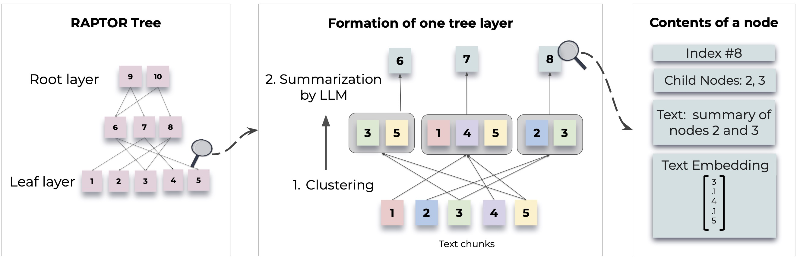

<!-- <p align="center">
  
</p>
<p align="left"> -->

<!-- <picture>
  <source media="(prefers-color-scheme: dark)" srcset="raptor.jpg" width="1000px">
  <source media="(prefers-color-scheme: light)" srcset="raptor_dark.png" width="1000px">
  
</picture> -->

<picture>
  <source media="(prefers-color-scheme: dark)" srcset="raptor_dark.png">
  
</picture>

## RAPTOR: Recursive Abstractive Processing for Tree-Organized Retrieval

**RAPTOR** introduces a novel approach to retrieval-augmented language models by constructing a recursive tree structure from documents. This allows for more efficient and context-aware information retrieval across large texts, addressing common limitations in traditional language models. 


For detailed methodologies and implementations, refer to the original paper:

- [RAPTOR: Recursive Abstractive Processing for Tree-Organized Retrieval](https://arxiv.org/abs/2401.18059)

[](https://huggingface.co/papers/2401.18059)
[](https://paperswithcode.com/sota/question-answering-on-quality?p=raptor-recursive-abstractive-processing-for)

## Installation

Before using RAPTOR, ensure Python 3.8+ is installed. Clone the RAPTOR repository and install necessary dependencies:

```bash
git clone https://github.com/parthsarthi03/raptor.git
cd raptor
pip install -r requirements.txt
```

## Basic Usage

To get started with RAPTOR, follow these steps:

### Setting Up RAPTOR

First, set your OpenAI API key and initialize the RAPTOR configuration:

```python
import os
os.environ["OPENAI_API_KEY"] = "your-openai-api-key"

from raptor import RetrievalAugmentation

# Initialize with default configuration. For advanced configurations, check the documentation. [WIP]
RA = RetrievalAugmentation()
```

### Adding Documents to the Tree

Add your text documents to RAPTOR for indexing:

```python
with open('sample.txt', 'r') as file:
    text = file.read()
RA.add_documents(text)
```

### Answering Questions

You can now use RAPTOR to answer questions based on the indexed documents:

```python
question = "How did Cinderella reach her happy ending?"
answer = RA.answer_question(question=question)
print("Answer: ", answer)
```

### Saving and Loading the Tree

Save the constructed tree to a specified path:

```python
SAVE_PATH = "demo/cinderella"
RA.save(SAVE_PATH)
```

Load the saved tree back into RAPTOR:

```python
RA = RetrievalAugmentation(tree=SAVE_PATH)
answer = RA.answer_question(question=question)
```


### Extending RAPTOR with other Models

RAPTOR is designed to be flexible and allows you to integrate any models for summarization, question-answering (QA), and embedding generation. Here is how to extend RAPTOR with your own models:

#### Custom Summarization Model

If you wish to use a different language model for summarization, you can do so by extending the `BaseSummarizationModel` class. Implement the `summarize` method to integrate your custom summarization logic:

```python
from raptor import BaseSummarizationModel

class CustomSummarizationModel(BaseSummarizationModel):
    def __init__(self):
        # Initialize your model here
        pass

    def summarize(self, context, max_tokens=150):
        # Implement your summarization logic here
        # Return the summary as a string
        summary = "Your summary here"
        return summary
```

#### Custom QA Model

For custom QA models, extend the `BaseQAModel` class and implement the `answer_question` method. This method should return the best answer found by your model given a context and a question:

```python
from raptor import BaseQAModel

class CustomQAModel(BaseQAModel):
    def __init__(self):
        # Initialize your model here
        pass

    def answer_question(self, context, question):
        # Implement your QA logic here
        # Return the answer as a string
        answer = "Your answer here"
        return answer
```

#### Custom Embedding Model

To use a different embedding model, extend the `BaseEmbeddingModel` class. Implement the `create_embedding` method, which should return a vector representation of the input text:

```python
from raptor import BaseEmbeddingModel

class CustomEmbeddingModel(BaseEmbeddingModel):
    def __init__(self):
        # Initialize your model here
        pass

    def create_embedding(self, text):
        # Implement your embedding logic here
        # Return the embedding as a numpy array or a list of floats
        embedding = [0.0] * embedding_dim  # Replace with actual embedding logic
        return embedding
```

#### Integrating Custom Models with RAPTOR

After implementing your custom models, integrate them with RAPTOR as follows:

```python
from raptor import RetrievalAugmentation, RetrievalAugmentationConfig

# Initialize your custom models
custom_summarizer = CustomSummarizationModel()
custom_qa = CustomQAModel()
custom_embedding = CustomEmbeddingModel()

# Create a config with your custom models
custom_config = RetrievalAugmentationConfig(
    summarization_model=custom_summarizer,
    qa_model=custom_qa,
    embedding_model=custom_embedding
)

# Initialize RAPTOR with your custom config
RA = RetrievalAugmentation(config=custom_config)
```

Check out `demo.ipynb` for examples on how to specify your own summarization/QA models, such as Llama/Mistral/Gemma, and Embedding Models such as SBERT, for use with RAPTOR.

Note: More examples and ways to configure RAPTOR are forthcoming. Advanced usage and additional features will be provided in the documentation and repository updates.

## Contributing

RAPTOR is an open-source project, and contributions are welcome. Whether you're fixing bugs, adding new features, or improving documentation, your help is appreciated.

## License

RAPTOR is released under the MIT License. See the LICENSE file in the repository for full details.

## Citation

If RAPTOR assists in your research, please cite it as follows:

```bibtex
@inproceedings{sarthi2024raptor,
    title={RAPTOR: Recursive Abstractive Processing for Tree-Organized Retrieval},
    author={Sarthi, Parth and Abdullah, Salman and Tuli, Aditi and Khanna, Shubh and Goldie, Anna and Manning, Christopher D.},
    booktitle={International Conference on Learning Representations (ICLR)},
    year={2024}
}
```

Stay tuned for more examples, configuration guides, and updates.
